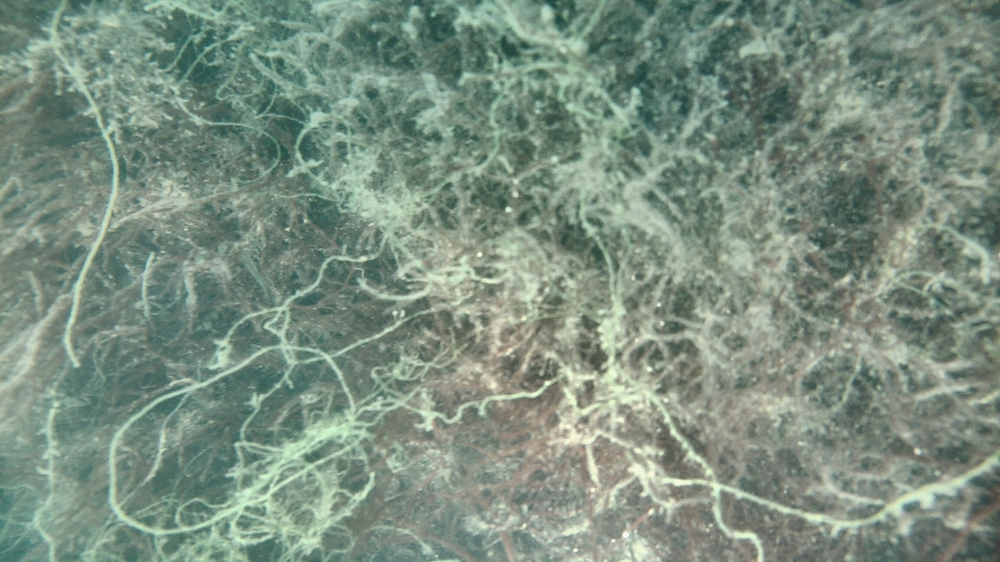
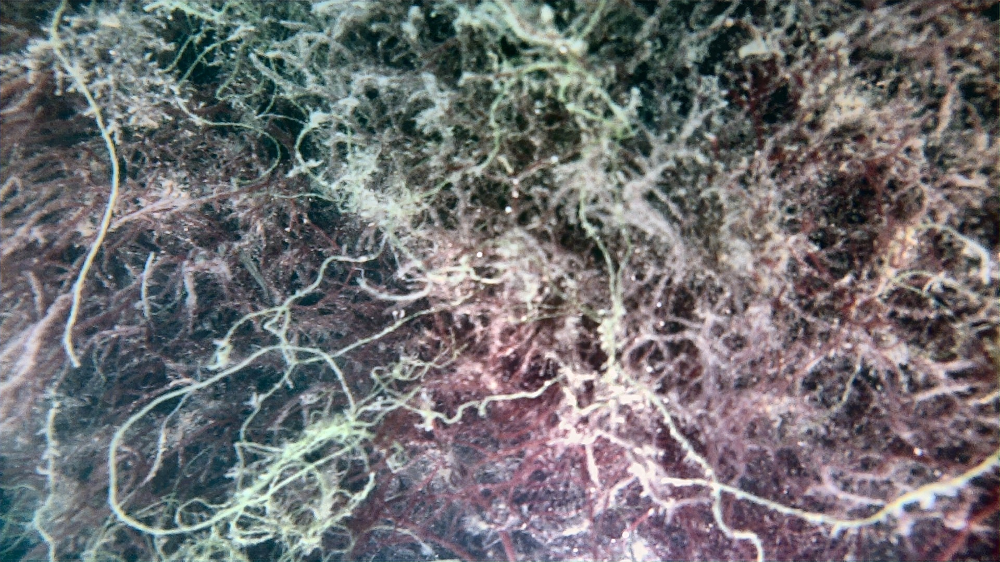

# nautilus_perception

## Guida all'Uso del Nodo di Enhancement

Il modulo di enhancement delle immagini sottomarine è progettato per essere **modulare e adattivo**. Può eseguire una pipeline pesante (WaterNet + Sharpening + CLAHE) su macchine dotate di GPU, oppure una pipeline ultraleggera (Sharpening + CLAHE) su dispositivi embedded come il Raspberry Pi.

Il sistema supporta tre modalità operative:

* **`auto` (Default):** Rileva automaticamente l'hardware. Se trova CUDA o MPS attiva WaterNet, altrimenti usa la versione leggera per CPU.
* **`force_off`:** Disabilita forzatamente WaterNet, eseguendo solo CLAHE e Sharpening (massimi FPS, ideale per Object Detection su Raspberry).
* **`force_on`:** Forza l'esecuzione di WaterNet anche in assenza di GPU dedicata (utile per testare il carico computazionale e la latenza).

Di seguito le istruzioni per utilizzare il modulo sia per i benchmark locali che in produzione tramite ROS 2.

---

## 1. Test Locale e Benchmark (Tramite file di Launch)

Per testare la pipeline su una singola foto fissa simulando il comportamento completo del nodo in ROS 2, è disponibile un file di launch dedicato. Questo metodo pubblica ciclicamente l'immagine e ti permette di misurare esattamente il ritardo in millisecondi e gli FPS risultanti.

**Requisito:** Assicurati di avere installato il pacchetto per la pubblicazione di immagini statiche.

```bash
sudo apt update
sudo apt install ros-jazzy-image-tools
```

**Come eseguire il test:**

1. Apri il file `launch/local_test.launch.py` all'interno del tuo pacchetto.

2. All'inizio della funzione, imposta la modalità operativa e il percorso dell'immagine di test.

3. Avvia il test da terminale:

```bash
ros2 launch nautilus_perception local_test.launch.py
```

4. Il terminale stamperà il log dei tempi di elaborazione (`Delay entrata-uscita`). L'immagine elaborata verrà automaticamente salvata nella home dell'utente (`~/enhancement_output.jpg`) grazie al parametro `save_output=True`.

---

### Benchmark di Riferimento (Raspberry Pi 5)

Durante i test di profilazione eseguiti sul target hardware (CPU ARM, no GPU), sono stati rilevati i seguenti carichi computazionali medi:

* **Modalità `force_on` (Pipeline Completa con WaterNet su CPU):**
* Latenza media: **~70,658.15 ms (~70.6 secondi per frame)**
* Framerate effettivo: **0.0 FPS**

* *Conclusione:* Inutilizzabile per applicazioni in tempo reale su dispositivi embedded.

* *Output di esempio:* `waternet_output.jpg`

* **Modalità `force_off` (Pipeline Leggera solo OpenCV - Sharpening + CLAHE):**
* Latenza media: **~65.3 - 67.1 ms per frame**
* Framerate effettivo: **~1.0 - 1.1 FPS** (con pubblicazione da file di test a 1Hz, salirebbe al limite della camera in streaming live)

* *Conclusione:* Prestazioni eccellenti e perfettamente compatibili con i vincoli di bordo per l'Object Detection.

* *Output di esempio:* `enhancement_output.jpg`

---

## 2. Risultati Visivi del Test Locale

Di seguito il confronto tra i file di output generati sulla home del Raspberry Pi nelle due modalità di test:

| Modalità WaterNet `force_off` (OpenCV) | Modalità WaterNet `force_on` (Rete Neurale) |
| :---: | :---: |
|  |  |
| *(File: `enhancement_output.jpg`)* | *(File: `waternet_output.jpg`)* |

---

## 3. Esecuzione in Produzione (Stereocamera)

Il nodo ROS 2 (`enhancement_node`) espone i parametri `waternet_mode` e `save_output` per configurare la pipeline in modo flessibile.

### Avvio tramite file Launch (Metodo Consigliato)

Per l'utilizzo reale in acqua, la configurazione ottimale si imposta direttamente nel file `launch/enhancement.launch.py`. Modificando la variabile `WATERNET_MODE` in cima al file su `'force_off'`, configurerai simultaneamente sia la telecamera destra che quella sinistra:

```bash
ros2 launch nautilus_perception enhancement.launch.py
```
